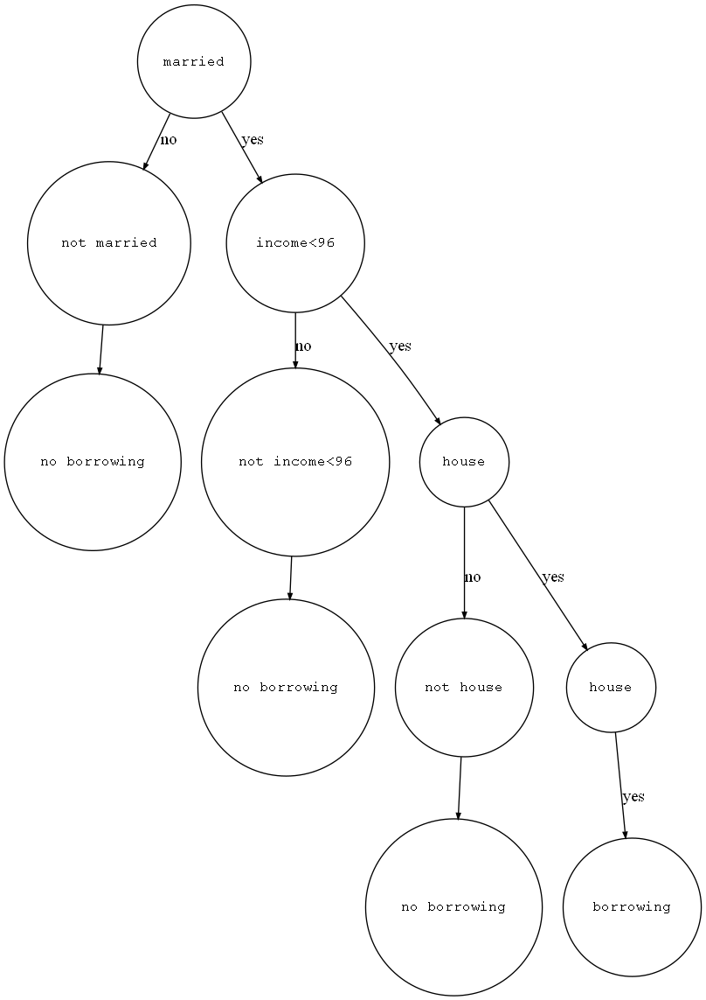

# GINI或Entropy在决策树中的使用

> [决策树](https://www.bilibili.com/video/BV1T7411b7DG)
>
> [知乎好文-决策树](https://zhuanlan.zhihu.com/p/30059442)
>
> 基础数据来自于视频例子,但是作者计算的gini数据错误,house的gini是0.34285,income的全局最优在96k,gini=0.3.

假设我们的数据如下(数据保存在`data.txt`),我们如何构建一个决策树使得对于一个用户可以判断其是否会拖延贷款?

|ID|有房|婚姻|年收入|拖欠贷款|
|--:|--:|--:|--:|--:|
|1|是|单身|125k|否|
|2|否|已婚|100k|否|
|3|否|单身|70k|否|
|4|是|已婚|120k|否|
|5|否|离异|95k|是|
|6|否|已婚|60k|否|
|7|是|离异|220k|否|
|8|否|单身|85k|是|
|9|否|已婚|75k|否|
|10|否|单身|90k|是|

决策树是用于解决分类问题的一种算法.首先针对决策树的属性选择有两种度量方式,熵和基尼系数,其值越低代表差异越大,区分效果越好

$Entropy = -\sum\limits_{i=0}^nP(i)log_2P(i)$

$Gini = 1-\sum\limits_{i=0}^nP(i)^2$

对于是否有房,这是一个二元属性.只有是/否两种类型.我们可以根据是/不是进行划分,划分之后再根据已知的标签(是否拖欠贷款)划分

- 有房者: 3/10 [id:1 4 7]
  - 拖欠: 0/3
  - 不拖欠: 3/3 [id: 1 4 7]
- 无房者: 7/10
  - 拖欠: 3/7 [id: 5 8 10]
  - 不拖欠: 4/7 [id: 2 3 6 9]

由此计算出的 Gini 系数为

$Gini_{有房者} = 1-[0+1] = 0$

$Gini_{无房者} = 1-[\frac{3}{7}^2+\frac{4}{7}^2] = \frac{24}{49}$

可以得到对于有房者的Gini系数为0,我们可以给他一个**不会拖欠贷款**的标签.

$Gini_{加权} = \frac{3}{10}*Gini_{有房者}+\frac{7}{10}*Gini_{无房者} = \frac{12}{35} \approx 0.343$

而对于婚姻情况是一个多元属性,我们可以采用 已婚/单身/离异 划分三种,也可以划分为 已婚/单身+离异, 对于该数据来说结果的差异不大,计算方法相同.

收入是一个序列属性,我们需要根据一个阈值进行划分,从最低收入到最高收入逐个选取阈值,计算 Gini 系数,最后选择最小的哪个(结果是96k)

最后再根据所得的三个属性的加权基尼系数最小的选择根节点(married),最后得到的决策树如下图所示

## Use

```python
cd homework-1
python main.py
```

arguments:

- `--gini`: use gini index
- `--entropy`: use entropy index
- `--draw`: draw the result picture by Graphiz for visualization.

  **Attention: you need to download the Graphiz first**

  - 首先到[Graphviz](http://graphviz.org/download/)官网下载电脑对应版本的安装程序,我使用的是[win10-64位](https://github.com/luzhixing12345/compilation-principle/releases/download/v0.0.2/windows_10_cmake_Release_graphviz-install-3.0.0-win64.exe)
  - 安装加入环境变量(可以安装时勾选)
  - 重启终端,输入`dot`测试

```python
python main.py --gini --draw
```

图片保存为`images/gini.png` | `images/entropy.png`,为该模型构建的决策树以及决策分支



## shortcoming

为了迅速完成作业我没有使用一个通用性的决策树生成模型,也就是说该模型仅针对我的数据是可以正确构建的,如果数据类型改变那么这个代码就完全不可用,通用性不够强.

一个通用性的决策树模型我会在作业二中构建

## introspection

这是一个二叉决策树,而且刚好划分出的分支的另一侧可以直接确定标签,并没有任何问题.

但如果是依然存在不同类的标签呢?比如已婚者也拖欠了贷款,这样的例子不就会产生错误标签了么?

如果为了准确性要更细分下去的话怕不是变成一个很深的多叉树,相当于最后还是做一个无监督的聚类? 给我的感觉是做一些简单的分类任务还是可以的,如果数据集很大,数据维度很高这种算法不见得效果会很好.

---

有任何问题欢迎留issue
