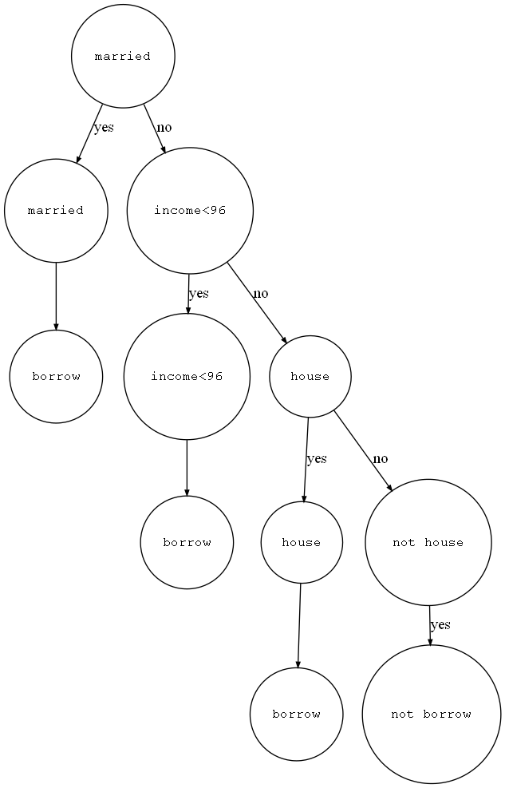

# GINI或Entropy在决策树中的使用

> [决策树](https://www.bilibili.com/video/BV1T7411b7DG)
>
> 基础数据来自于视频例子,但是作者计算的gini数据错误,house的gini是0.34285,income的全局最优在96k,gini=0.3.

假设我们的数据如下(数据保存在`data.txt`),我们如何构建一个决策树使得对于一个用户可以判断其是否会拖延贷款?

|ID|有房|婚姻|年收入|拖欠贷款|
|--:|--:|--:|--:|--:|
|1|是|单身|125k|否|
|2|否|已婚|100k|否|
|3|否|单身|70k|否|
|4|是|已婚|120k|否|
|5|否|离异|95k|是|
|6|否|已婚|60k|否|
|7|是|离异|220k|否|
|8|否|单身|85k|是|
|9|否|已婚|75k|否|
|10|否|单身|90k|是|

## Use

```python
cd homework-1
python main.py
```

arguments:

- `--gini`: use gini index
- `--entropy`: use entropy index
- `--draw`: draw the result picture by Graphiz for visualization.

  **Attention: you need to download the Graphiz first**

  - 首先到[Graphviz](http://graphviz.org/download/)官网下载电脑对应版本的安装程序,我使用的是[win10-64位](https://github.com/luzhixing12345/compilation-principle/releases/download/v0.0.2/windows_10_cmake_Release_graphviz-install-3.0.0-win64.exe)
  - 安装加入环境变量(可以安装时勾选)
  - 重启终端,输入`dot`测试

```python
python main.py --gini --draw
```

图片保存为`images/gini.png` | `images/entropy.png`,为该模型构建的决策树以及决策分支



## shortcoming

为了迅速完成作业我没有使用一个通用性的决策树生成模型,也就是说该模型仅针对我的数据是可以正确构建的,如果数据类型改变那么这个代码就完全不可用,通用性不够强.

---

有任何问题欢迎留issue
